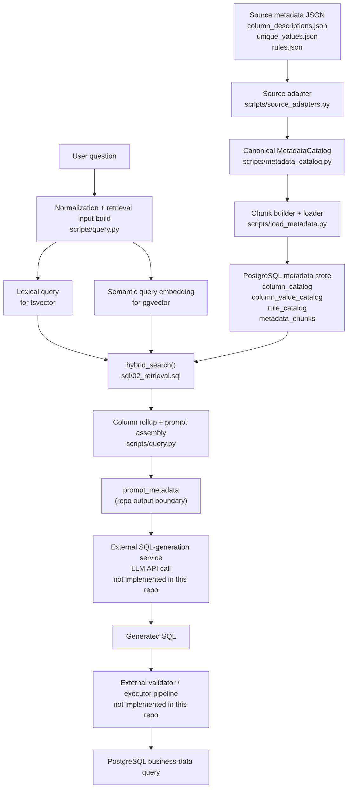

# Dataflow

## Purpose

This repo implements the metadata retrieval side of a text-to-SQL stack.

It is responsible for:

- loading metadata from source files
- normalizing that metadata into a canonical internal catalog
- building retrieval chunks
- storing chunks in PostgreSQL with `tsvector` and `pgvector`
- retrieving and rolling hits up to table-qualified columns
- assembling `prompt_metadata`

It is not responsible for:

- calling the SQL-generation LLM
- generating SQL
- validating generated SQL
- executing final business-data SQL against the target application schema

Those steps belong to an external orchestration layer.

## End-to-end diagram

## Offline flow

1. Read source metadata files from `data/` or a custom source directory.
2. Convert raw source shape into `MetadataCatalog`.
3. Validate required contracts such as `resource_owner`, `resource_namespace`, explicit `table_name + column_name`, and low-cardinality value groups.
   The reserved `::` separator is not allowed inside raw source identifiers because `table_name::column_name` is reserved for logs and human debugging.
4. Build `column_definition`, `value_definition`, and placeholder `rule` chunks.
5. Generate embeddings for `text_semantic`.
6. Write source tables and `metadata_chunks` into PostgreSQL.

## Online flow

1. Receive a raw user question.
2. Normalize it for lexical retrieval while keeping the original phrasing for semantic embedding.
3. Run `hybrid_search()` inside one `resource_owner/resource_namespace`.
4. Roll chunk hits up to table-qualified columns.
5. Build `prompt_metadata` with:
   - `normalized_query`
   - `candidate_columns`
   - matched values
   - matched rules
6. Return that metadata bundle to the caller.

The caller is expected to perform the LLM API call for SQL generation outside this repo.

## Current repo boundary

The practical output of this repo is:

- the PostgreSQL metadata index
- the retrieval result set
- the `prompt_metadata` bundle

The practical input from the future SQL-generation layer is outside this repo:

- LLM model choice
- prompt template
- API call / retry logic
- SQL validation
- final query execution and answer rendering
